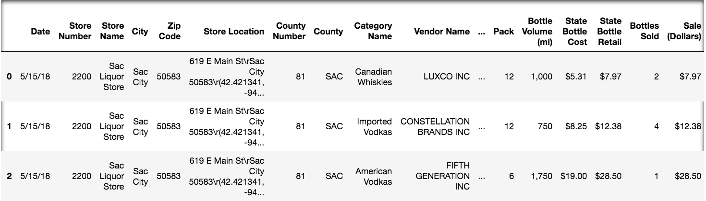
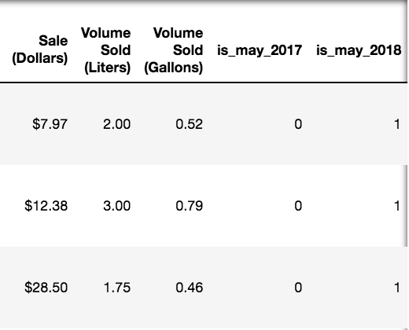

<!--
---
title: Pandas I
type: lesson
duration: "1:00"
creator: [Joseph Nelson](https://twitter.com/josephofiowa)
Private gist location: xxxxxx
Presentation URL: xxxxx
---
-->

##  Pandas I

---

## Learning Objectives
*After this lesson, you will be able to:*

- Use Pandas to read in a dataset.
- Investigate a dataset's integrity.
- Filter, sort, and manipulate DataFrame series.

---

## What is Pandas?
- A group of adorable bears 🐼🐼🐼
- A Python library for data manpulation.

## 

---

## So, Pandas the Library

<!--
Talking points:
"Pandas is the most prominent Python library for exploratory data analysis (EDA). The functions Pandas supports are integral to understanding, formatting, and preparing our data. Formally, we use Pandas to investigate, wrangle, munge, and clean our data. Pandas is the Swiss Army Knife of data manipulation!"
"Pandas began as a humble open source project for Panel Data (hence "Pandas") in 2009 by Wes McKinney. It has grown to be the most use Python-related tag on Stack Overflow."
-->

The Swiss Army Knife of data manipulation!

Pandas:
- Is *the* library for exploratory data analysis (EDA).
- Formats, wrangles, cleans, and prepares our data.

Quick Backstory from 2009:
- A humble open source project for Panel Data (hence "Pandas") from Wes McKinney.
- Now the most used Python-related tag on Stack Overflow.

< Some sort of picture of something cool in Pandas here, like a graph, idk, something>

---

## What is Exploratory Data Analysis (EDA)?

<!-- 
Talking points:
"Exploratory Data Analysis (EDA) is the process of understanding our dataset, and producing our first level of insights. This includes reading in the data, understanding our data dictionary, checking data types, assessing descriptive statistics, renaming columns, joining together data, looking for missing data, and so much more. That sounds like a lot, but today, we will just focus on the most 'mission critical' elements of EDA."
-->

The process of understanding our dataset and producing our first level of insights.

This includes:
- Reading in data 
   - "Import dog population data"
- Checking data types 
   - "Is the population coutn in integers?"
- Renaming columns.
    - "`dog_breed` is more helpful than `Biological Family`"
- Joining together data.
     - "We have dog population by continent; let's join human population on continent"
- Looking for missing data.
     - "How many labrador retrievers are there in the United States?"
- And more!

Today, we will focus on the most 'mission critical' elements of EDA.

---

PS: Sometimes Pandas can be a little frustrating...

## 

Perseverance is key! It gets easier

---

## What dataset are we exploring?

For today's Pandas exercises, we will be using a real dataset from the state of Iowa government on liquor sales. Due to state licensing laws, stores must report daily transactions of all alcohol they sell to the Iowa Department of Commerce's Alcoholic Beverages Division. The state of Iowa makes this data available for analysis -- and it is an excellent, structured dataset for our use!

Take a look at the data source [page](https://data.iowa.gov/Economy/Iowa-Liquor-Sales/m3tr-qhgy).

---

Let's take a closer look at the data dictionary, or what is included:

- **Invoice/Item Number** - Concatenated invoice and line number associated with the liquor order. This provides a unique identifier for the individual liquor products included in the store order
- **Date** - Date of order 
- **Store Number** - Unique number assigned to the store who ordered the liquor.
- **Store Name** - Name of store who ordered the liquor.
- **Address** - Address of the store that ordered the liquor
- **City** - City where the store who ordered the liquor is located
- **Zip Code** - Zip Code of where the store that ordered is located 
- **Store Location** - Location of store who ordered the liquor. The Address, City, State and Zip Code are geocoded to provide geographic coordinates. Accuracy of geocoding is dependent on how well the address is interpreted and the completeness of the reference data used.
- **County Number** - Iowa county number for the county where store who ordered the liquor is located
- **County** - County where the store who ordered the liquor is located
- **Category** - Category code associated with the liquor ordered
- **Category Names** - Category of the liquor ordered.
- **Vendor Number** - The vendor number of the company for the brand of liquor ordered
- **Vendor Name** - The vendor name of the company for the brand of liquor ordered
- **Item Name** - Item number for the individual liquor product ordered.
- **Item Description** - Description of the individual liquor product ordered.
- **Pack** - The number of bottles in a case for the liquor ordered
- **Bottle Volume (mL)** - Volume of each liquor bottle ordered in milliliters.
- **State Bottle Cost** - The amount that Alcoholic Beverages Division paid for each bottle of liquor ordered
- **State Bottle Retail** - The amount the store paid for each bottle of liquor ordered
- **Bottles Solde** - The number of bottles of liquor ordered by the store
- **Sale (Dollars)** - Total cost of liquor order (number of bottles multiplied by the state bottle retail)
- **Volume Sold (Liters)** - Total volume of liquor ordered in liters. (i.e. (Bottle Volume (ml) x Bottles Sold)/1,000)
- **Volume Sold (Gallons)** - Total volume of liquor ordered in gallons. (i.e. (Bottle Volume (ml) x Bottles Sold)/3785.411784)

---

## What can we examine?

> **Class Question:** What are some potential insights you'd like to uncover given Iowa liquor data? What if you are examining it from the standpoint of the Iowa government? What if you are a potential liquor store business owner?

---

## Our Modified Iowa Liquor Dataset

Because the full dataset (of all liquor sales from 2012 to present) is greater than 13 million rows (13,948,103+ at the time of writing), **we will work with a modified dataset.**

Our modified dataset has a few key changes:
- Only sales from May 2017 and May 2018 are present
- A number of values have been deliberately deleted (to practice working with missing data!)
- An arbitrary subset of entire observations have been deleted (to reduce the file size from 119MB to <100MB)
- A few columns were removed (invoice, address, vendor number, category as a number, county number)

Here's a look at the first couple rows (truncated to two slides:)

---

## 

---

## 

---

## What determines 'data integrity?'

Data integrity means assuring our data can be trusted to produce meaningful insights. When we are assessing data integrity, we are concerned with:

- Correctly formatted datatypes
   - "Hey, dollars is a float, not a string"
- A sample is representatitve of the underlying population of interest
   - "Did we only sample liquor store sales in cities, or across the whole state?"
- Data is not missing
    - "Why do we only have even days of the month?" (In reality, we are missing *some* data!)
- Bias is removed from our observations - both sampling bias and human bias
     - "Did we only consider liquor sales of specific varieties?"

---

## The clean truth about dirty data

In reality, 'assessing data integrity' isn't a one-stop step. Much like EDA itself, it's an ongoing process where we uncover additional potential problems and anamolities to remedy along the way. 

Today, we'll uncover key techniques to identify skews and data types that inhibit progress.

---

## Launch our notebook

Now, launch your Jupyter Notebook like we demonstrated in our introductory lesson.

The `.ipynb` file you will open is called " `pandas-i.ipynb` "

## Additional Resources

- Pandas [documentation](https://pandas.pydata.org/pandas-docs/stable/)
- DataSchool [30-video series](http://www.dataschool.io/easier-data-analysis-with-pandas/) (by a former GA instructor!)

